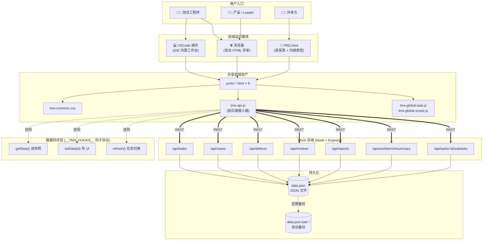
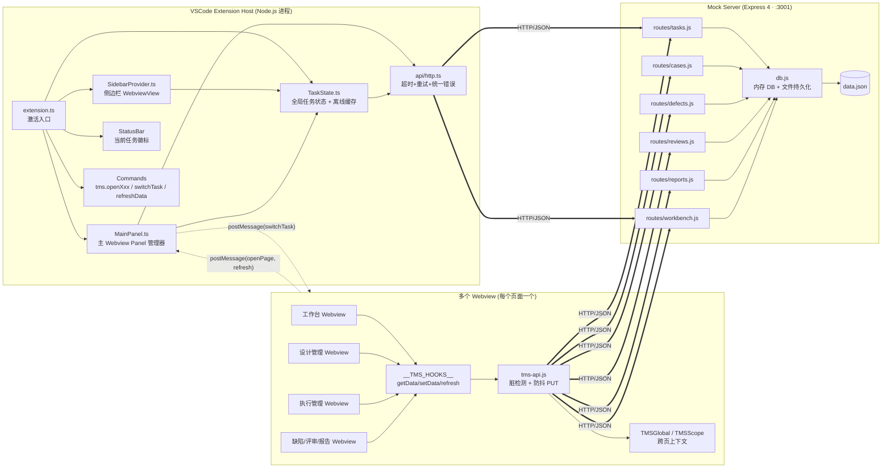
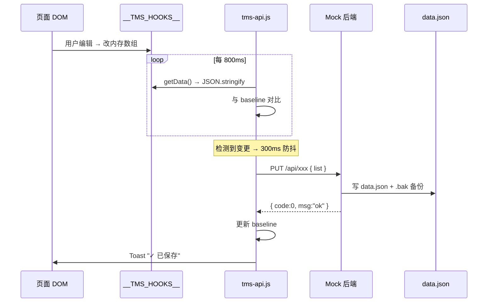
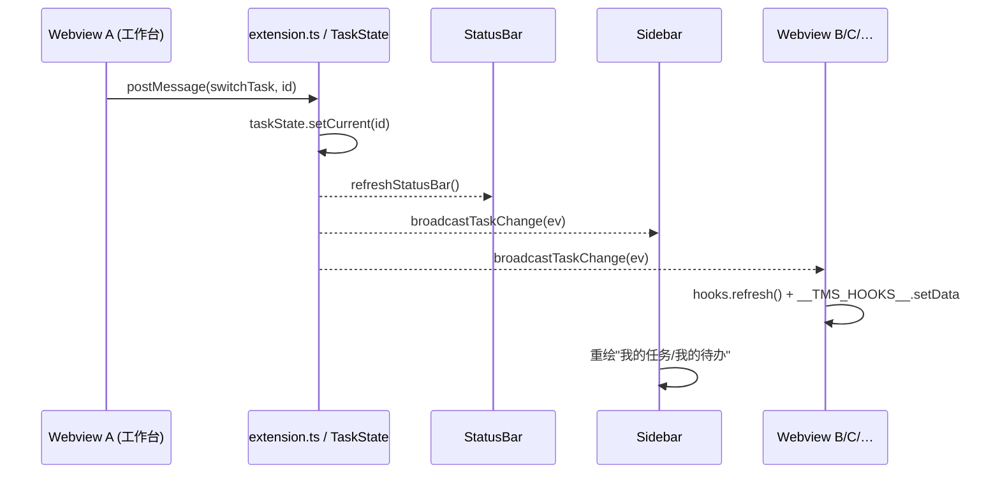
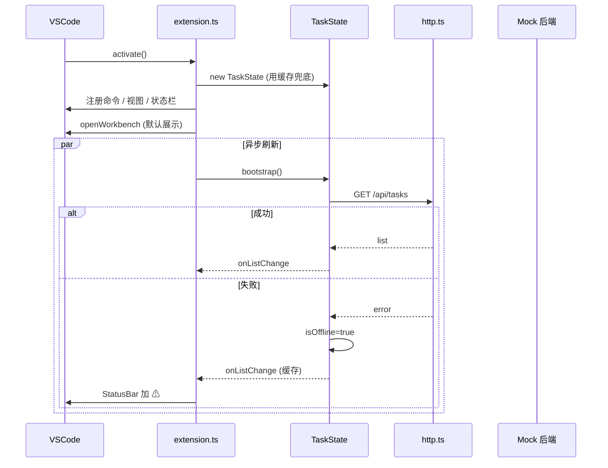
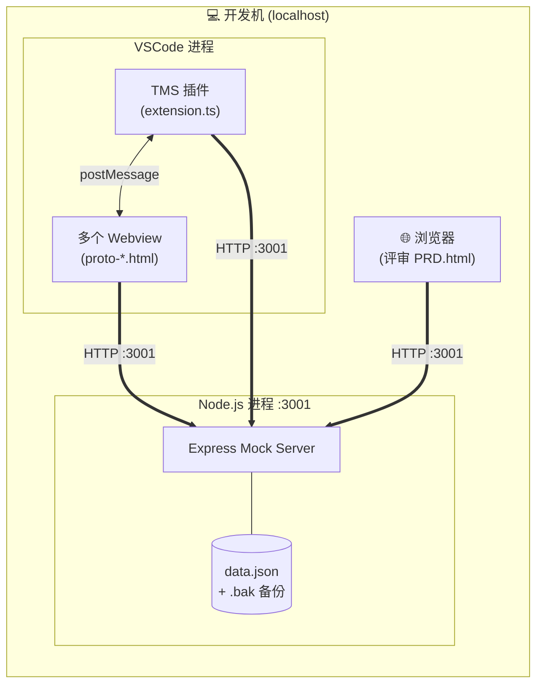
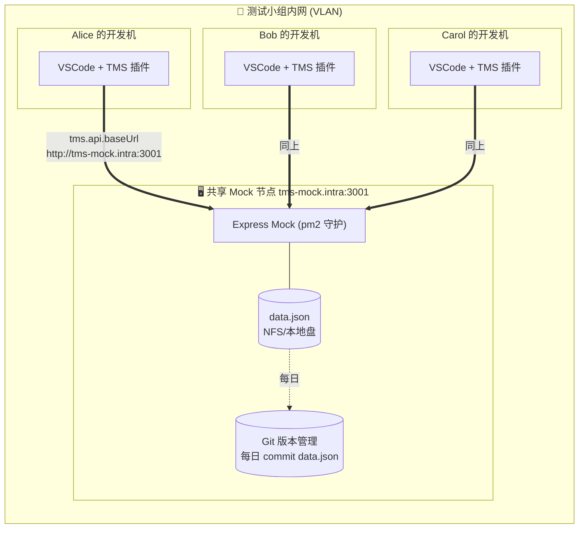
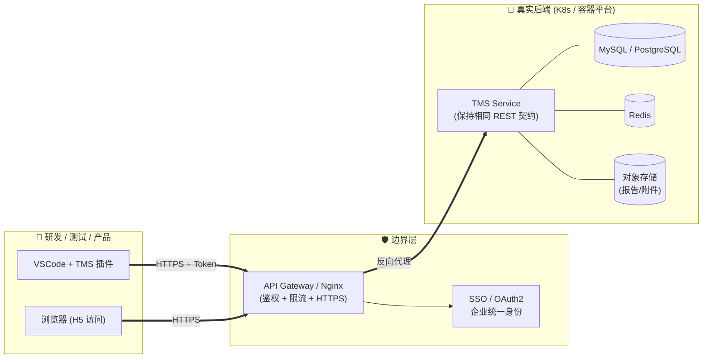
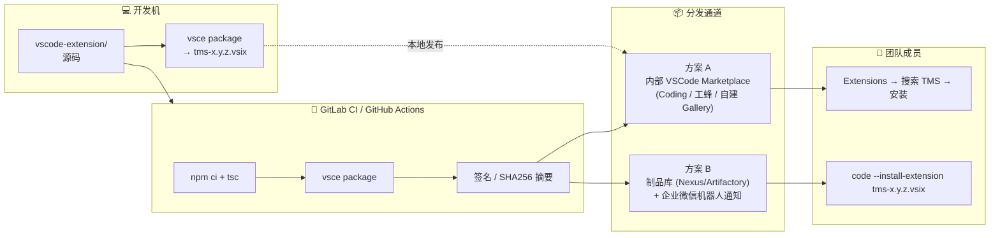
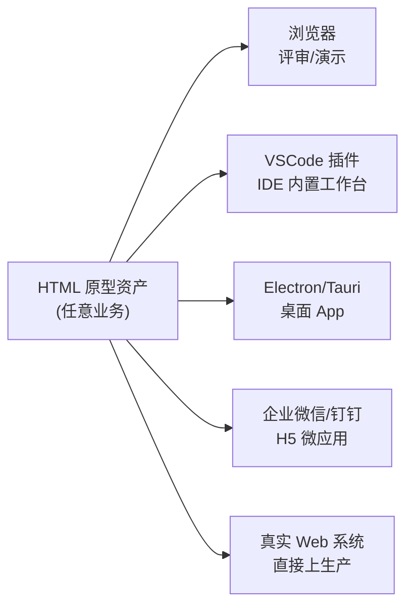

# TMS 测试任务管理平台 — 技术方案与创新点

> 从「PRD 原型图」到「可嵌入 IDE 的 VSCode 插件」的一体化落地方案
>
> 版本：v2.0 · 覆盖模块：PRD 原型 / Mock 后端 / VSCode 插件
>
> 升级说明：新增「总体设计图」「详细架构图」「6 大技术关键点代码级解读」

---

## 一、方案概览

本项目用 **"原型即产品、插件即工位"** 的思路，把 9 个 HTML 原型页（工作台、任务列表、任务详情、设计、执行、缺陷、评审、报告等）直接变成：

1. 可独立浏览评审的 **PRD 高保真原型**；
2. 可真实增删改查的 **Mock 后端 + 前端数据层**；
3. 可在 VSCode 侧边栏"开箱即用"的 **IDE 内置测试任务工作台插件**。

三层产物共享同一套 HTML/CSS/JS 资产和同一份 REST 契约，**一次开发、三处运行**。

---

## 二、总体设计图（System Overview）

以下是平台的总体分层视图，展示「用户入口 → 前端运行载体 → 数据同步层 → 后端服务 → 持久化层」的全链路。



### 设计总览要点

| 层 | 关键决策 | 价值 |
|---|---|---|
| 用户入口 | 3 类角色，3 种打开方式 | 一次开发，覆盖评审/开发/演示 |
| 前端载体 | 浏览器 / VSCode / PRD.html 三端复用同一份 `proto-*.html` | 零重写 |
| 共享资产 | `tms-api.js` + `tms-global-*.js` 是"前端中间件" | 页面只关心渲染，不关心通信 |
| 同步层 | `__TMS_HOOKS__` 钩子协议代替框架的 reactive | 无 Vue/React 依赖 |
| Mock 后端 | 单文件 JSON 持久化 + 统一响应体 | 可 `git diff` 的"数据库" |

---

## 三、详细架构图（Detailed Architecture）

下图展示了 **VSCode 插件内部的组件关系** 与 **与 Mock 后端的交互回路**，标注了关键事件、消息和数据流。



### 关键交互路径

1. **激活链路**：`extension.ts` → `TaskState.bootstrap()` 异步拉后端 → 同时注册 SidebarProvider / 命令 / StatusBar → 默认打开工作台 Webview。
2. **任务切换广播**：任意 Webview 点任务切换 → `postMessage(switchTask, id)` → `TaskState.setCurrent()` → `onChange` 事件触发 → 广播给所有已打开的 Panel + 侧边栏 + StatusBar。
3. **自动落盘链路**：Webview 内 DOM 变更 → `__TMS_HOOKS__.getData()` 脏检测 → 300ms 防抖 → `PUT` 整表 → Mock 更新 `data.json`。
4. **离线降级**：`http.ts` 请求失败 → `TaskState.isOffline()=true` → StatusBar 出现 ⚠ 徽标 → 页面继续使用本地种子数据，避免白屏。

---

## 四、技术栈清单

### 4.1 前端原型层
| 技术 | 作用 |
|---|---|
| 纯 HTML5 / CSS3 / 原生 ES2020 | 零构建、双击可开；保证评审与试跑门槛最低 |
| CSS 变量 + 语义化类名（`tms-common.css`） | 统一色板、间距、卡片等 Design Token |
| 原生 `fetch` + `AbortController` | 请求封装，支持超时、取消 |
| `navigator.sendBeacon` | 页面关闭前兜底落盘，防数据丢失 |
| `setInterval` 800ms 脏检测 + 300ms 防抖 | 无框架环境下的"响应式"数据回写 |

### 4.2 前后端对接层
| 技术 | 作用 |
|---|---|
| `window.__TMS_HOOKS__` 钩子协议 | 页面以"钩子协议"暴露 `getData / setData / refresh` |
| `tms-api.js` 通用接入器 | 自动完成：初始拉取 → 脏检测 → 防抖 PUT → 切任务 flush |
| `TMSGlobal` / `TMSScope` 全局上下文 | 跨页同步当前任务、子任务、阶段、轮次 |
| `CustomEvent('tms_subtasks_ready')` | 子任务下拉数据异步就绪事件 |

### 4.3 Mock 后端
| 技术 | 作用 |
|---|---|
| Node.js ≥ 16 + Express 4 | 轻量 REST |
| `cors` | 跨域放通，支持 Webview 与 file:// 访问 |
| JSON 文件持久化 + 写前 `.bak` 备份 | 无需 DB，读写即生效 |
| 统一响应体 `{code, data, msg}` | 对齐真实后端契约，未来可无缝替换 |
| 环境变量 `PORT` / `LATENCY` | 模拟慢网、端口冲突 |

### 4.4 VSCode 插件
| 技术 | 作用 |
|---|---|
| TypeScript 5 | 类型安全 |
| `vscode.WebviewViewProvider` + `WebviewPanel` | 侧边栏 + 多 Tab 主面板 |
| `retainContextWhenHidden: true` | Webview 切换不丢失前端状态 |
| `Webview.asWebviewUri` | 把原型资产映射成 `vscode-resource://` 安全 URL |
| `postMessage` 双向通道 | Host ↔ Webview 通信 |
| `workspace.getConfiguration('tms.api')` | 动态配置 `baseUrl` / `timeout` / `retry` |
| `StatusBarItem` + `QuickPick` | 当前任务显示 + 任务切换 |
| `@vscode/vsce` | 打包 `.vsix` 产物 |

---

## 五、技术关键点（详解）

### 🔑 关键点 1：`__TMS_HOOKS__` 钩子协议 —— 无框架的"响应式数据绑定"

**设计动机**：在不引入 Vue/React 的前提下，让 9 个原型页都能自动完成"加载 → 变更 → 回写"。

**实现要点**：每个页面只暴露一个约定对象即可全自动接入：

```js
// proto-design.html 内
window.__TMS_HOOKS__ = window.__TMS_HOOKS__ || {};
window.__TMS_HOOKS__.design = {
  getData: () => CASES,         // 返回当前页的核心数据（数组）
  setData: (list) => {          // 接收后端数据，覆盖并重渲染
    CASES.splice(0, CASES.length, ...list);
    renderTable();
  },
  refresh: () => renderTable()  // 任务切换后重新渲染
};
```

`tms-api.js` 的 `attachHook()` 则统一接管所有生命周期：

```js
// 1) 首次加载：GET → setData → 保存 baseline 快照
reload();

// 2) 每 800ms 脏检测：当前序列化 ≠ baseline ⇒ 触发防抖
setInterval(() => {
  if (syncing) return;
  const cur = JSON.stringify(safeClone(hook.getData()));
  if (cur !== baseline) scheduleFlush();   // 300ms 防抖
}, 800);

// 3) flush：整表 PUT，成功后更新 baseline，失败 Toast
function flush() {
  const snapshot = JSON.stringify(safeClone(hook.getData()));
  if (snapshot === baseline) return;
  syncing = true;
  opts.save(curTaskId, JSON.parse(snapshot))
    .then(() => { baseline = snapshot; showToast('✓ 已保存'); })
    .catch(err => showToast('✗ ' + err.message, true))
    .finally(() => { syncing = false; });
}
```

**亮点细节**：

- **字段兜底合并**：`taskList` 的 `load` 做了「后端字段优先 + 本地展示字段兜底」，解决了后端 schema 精简而前端需要展开行附加字段的落差（见 `tms-api.js` 内的 `localMap` 合并逻辑）。
- **空数据保护**：后端返回 `[]` 但本地已有种子数据时，**保留本地**，避免清空原型。
- **并发防护**：`syncing` 信号量 + `baseline` 快照，确保 PUT 进行时不会重复触发。
- **兜底落盘**：`beforeunload` 时用 `navigator.sendBeacon` 发 Blob，浏览器关闭也能保住最后一次变更。

**价值**：新增一页只需 **3 个函数**，所有加载、校验、回写、切任务 flush、页面关闭兜底，全部零重复。

---

### 🔑 关键点 2：`TMSGlobal` / `TMSScope` —— 跨页多层级全局上下文

**业务复杂度**：测试域天然是多层级筛选：

```
任务 Task → 子任务 Subtask → 阶段 Stage(ST/UAT/Merge) → 轮次 Round(R1,R2…)
```

如果每个页面各自实现筛选器，**切页就会丢上下文**。解决方案是抽出两个全局单例：

- `TMSGlobal`：当前任务 ID，`onChange` 订阅模式；持久化到 `localStorage`，跨 Tab 同步。
- `TMSScope`：子任务 / 阶段 / 轮次筛选，发布-订阅结构，供设计 / 执行 / 缺陷 / 评审 / 报告共享。

**子任务动态预拉取**：因为任务 ID 可能是新扩展的（如 `T-2026-0115`），本地字典 `SUBTASKS_BY_TASK` 不包含它。`tms-api.js` 的 `attachSubtasksPreloader()` 会在启动和任务切换时：

```js
TMSApi.listSubtasks(tid)
  .then(normalizeSubtasksPayload)            // 统一成 {id,name,stages:[{code,name}]}
  .then(list => {
    window.TMS_SUBTASKS[tid] = list;
    window.TMS_SUBTASKS_CURRENT = list;
    window.dispatchEvent(new CustomEvent('tms_subtasks_ready', {
      detail: { taskId: tid, list }
    }));
  });
```

页面监听 `tms_subtasks_ready` 事件即可重新渲染子任务下拉，**"切换任务后下拉为空"问题被彻底根治**。

---

### 🔑 关键点 3：VSCode 插件三端联动（Host ↔ Sidebar ↔ 多 Panel）

**核心组件**（全部位于 `vscode-extension/src/`）：

| 组件 | 职责 | 文件 |
|---|---|---|
| `extension.ts` | 激活入口，注册命令/状态栏/视图/配置 | 132 行 |
| `TaskState.ts` | 全局任务状态，离线缓存，事件总线 | 事件：`onChange` / `onListChange` |
| `SidebarProvider.ts` | 侧边栏 WebviewView，展示"我的任务 / 我的待办" | 实现 `WebviewViewProvider` |
| `MainPanel.ts` | 主面板多 Tab 管理（工作台/设计/执行…） | 静态 `show()` + `broadcastTaskChange()` |
| `api/http.ts` | 超时 + 重试 + 统一错误响应 | 使用 `AbortController` |

**联动的 3 个典型场景**：

**场景 A：任务切换广播（从任一入口触发，3 端同步）**

```
       ┌────────────┐ postMessage         ┌────────────┐
       │ Webview A  │────switchTask───────▶ extension.ts
       └────────────┘                     │ taskState.setCurrent(id)
                                          │     │ onChange 事件
                                          │     ├─▶ StatusBar.refresh
                                          │     ├─▶ SidebarProvider.broadcastTaskChange
                                          │     └─▶ MainPanel.broadcastTaskChange
                                          ▼
                            ┌───────────────────────────────┐
                            │ Sidebar / 所有已打开 Webview    │
                            │ 同步刷新当前任务上下文           │
                            └───────────────────────────────┘
```

**场景 B：离线降级**

`TaskState.refreshFromApi(false)` 失败时：
- `isOffline()` 置 true；
- StatusBar 文案：`$(checklist) 任务名 $(warning)`，鼠标悬停提示"后端不可达，点击切换任务"；
- 页面数据继续使用上次缓存（`globalState.update` 持久化）；
- 任何时候用户执行 `tms.refreshData` 可触发重试。

**场景 C：配置化后端切换**

```ts
vscode.commands.registerCommand('tms.setApiBaseUrl', async () => {
    const input = await vscode.window.showInputBox({ value: current });
    if (!input) return;
    await cfg.update('baseUrl', input, vscode.ConfigurationTarget.Global);
    await taskState.refreshFromApi(false);   // 立即用新地址刷一次
});
```

Webview 侧则通过 `postMessage('getConfig')` 问询，得到后通过 `window.TMS_BACKEND_BASE` 覆盖 `tms-api.js` 的 `BASE`，**Mock ↔ 真实后端一键切换，无需重装插件**。

---

### 🔑 关键点 4：原型零改动嵌入 Webview 的资源映射

VSCode Webview 有 **Content Security Policy** 限制，且资源必须通过 `asWebviewUri` 映射。本方案的处理：

1. **路径统一**：原型用相对路径（`./tms-common.css`、`./tms-api.js`），插件侧把 `prd/测试任务管理/` 整个目录作为 Webview 的 `localResourceRoots`。
2. **占位符注入**：`MainPanel.ts` 读 HTML 后，先将所有 `<link href="xxx.css">` / `<script src="xxx.js">` 的路径用 `panel.webview.asWebviewUri(Uri.joinPath(root, 'xxx'))` 替换，再 set 到 `panel.webview.html`。
3. **CSP Nonce**：注入 `<meta http-equiv="Content-Security-Policy" ...>`，加上 `nonce-{random}`，inline 脚本带 `nonce` 属性，既保证安全又允许原型中的少量 inline 逻辑运行。
4. **结果**：原型改一行 → VSCode 内重载即生效，**零重写成本**。

---

### 🔑 关键点 5：Mock 后端的"文件即数据库"设计

**关键特性**：

- **单文件 JSON**：全部业务数据在 `mock-server/data.json`，结构化清晰；
- **写前备份**：每次 PUT 前自动生成 `data.json.bak.{timestamp}`，出问题可 1 秒回滚；
- **脏读保护**：`db.js` 对读写加了内存锁，防止并发 PUT 撕裂数据；
- **延迟注入**：`LATENCY=500 npm start` 可模拟慢网，验证前端 loading/降级逻辑；
- **统一响应壳**：

```js
// routes/*.js 统一
res.json({ code: 0, data: { list }, msg: 'ok' });
// 错误
res.status(400).json({ code: 40001, data: null, msg: '阶段互斥校验失败' });
```

**未来演进**：真实后端只需遵守同一响应结构，**前端零改动**，插件改 `baseUrl` 即可。

---

### 🔑 关键点 6：侧边栏工作台的"固定栅格 + 分页加载"

来自用户实际反馈的两个产品细节，也是很多"把网页套壳"方案容易忽略的点：

| 需求 | 实现 |
|---|---|
| 我的测试任务：一行 3 个、默认 2 行、点更多 +3 | CSS `grid-template-columns: repeat(3, 1fr)`；JS 维护 `shown` 游标，点更多 `shown += 3`，`render(list.slice(0, shown))` |
| 我的待办：默认 6 个、每次 +6 | 同样游标分页，支持"一键加载全部" |
| 版块位置固定，不随窗口宽度跳动 | 侧边栏容器 `min-width: 320px`，内部卡片用 `flex-basis` 固定最小宽度；超出用滚动，而非挤压 |

这些看似琐碎的 UX 细节，在 IDE 这种"经常调整分栏"的环境里 **直接决定用户是否愿意持续使用**。

---

## 六、方案优势

### 🎯 优势 1：评审 = 演示 = 开发，三位一体
PRD 原型可双击打开给产品/老板看 → 同一套页面在 VSCode 里就是开发工作台 → Mock 后端让"原型能真实增删改查"。**一份资产，三处运行**。

### 🎯 优势 2：零构建、零框架依赖，新人 5 分钟上手
- 前端无 `npm install`、无 webpack、无 tsconfig；
- 后端只依赖 `express` + `cors`；
- 插件侧 TypeScript 仅作为类型工具，不引入任何前端框架。

### 🎯 优势 3：REST 契约对齐真实后端，平滑演进
Mock 与真实后端使用**完全一致的路径、Method、响应结构**。替换路径：仅需修改 `tms.api.baseUrl`。

### 🎯 优势 4：数据可追溯、可回滚
`data.json` + 自动 `.bak` + git 版本管理，任何异常数据都能找回。

### 🎯 优势 5：IDE 工作台显著提升测试效率
测试同学不再"开 5 个浏览器 Tab + 1 个 IDE"；任务切换、刷新按钮、全局上下文让"测什么、测到哪一轮、有哪些缺陷"一目了然。

### 🎯 优势 6：扩展性
- 新增一页：复制 `proto-*.html` → 挂 `__TMS_HOOKS__` → 插件 `package.json` 增加一个命令即可；
- 新增一个业务实体：加一份 `routes/xxx.js`，前端加一个 hook key，完事；
- 接真实后端：契约不变，只改 `baseUrl`。

### 🎯 优势 7：风险可控
- 前后端解耦，Mock 后端宕机不影响原型展示（前端有降级逻辑）；
- 双层校验（前端 + Mock 后端）守住域模型硬约束（如阶段互斥）；
- 插件不需要用户手动打包分发，`F5` 即可本地运行。

---

## 七、关键时序图

### 7.1 `tms-api.js` 自动落盘时序



### 7.2 VSCode 插件任务切换广播



### 7.3 启动与离线降级



---

## 八、部署拓扑图（Deployment Topology）

本方案从"单机调试"到"团队落地"共有 **4 个演进阶段**，每个阶段的部署形态都非常轻量，**不需要独立运维**。

### 8.1 阶段一：单机开发/自测（Mock 模式，当前默认）

最轻量的形态：**一台开发机**，`Mock 后端` 与 `VSCode 插件` 均跑在本机。



| 特性 | 说明 |
|---|---|
| 启动命令 | `npm start`（Mock）+ VSCode `F5`（插件） |
| 端口 | `3001`（可 `PORT=xxxx npm start` 改写） |
| 数据位置 | `mock-server/data.json` |
| 适用场景 | 开发自测、评审演示、离线 Demo |

---

### 8.2 阶段二：团队共享 Mock（局域网模式）

把 Mock 后端部署到一台**公用开发机**或**内网小服务器**，多位测试同学的 VSCode 插件共用一份数据，适合"小组内联调"。



| 特性 | 说明 |
|---|---|
| 部署方式 | `pm2 start server.js --name tms-mock` |
| 切换方式 | 插件命令 `tms.setApiBaseUrl` → 填 `http://tms-mock.intra:3001` |
| 数据共享 | 所有人共用一份 `data.json`；每日 cron 自动 `git commit` 留痕 |
| 风险控制 | 写前 `.bak` + Git 双保险，数据可回滚到任意时间点 |

---

### 8.3 阶段三：接入真实后端（生产联调 / 准生产）

Mock 后端退居二线（仍作为离线 Demo 保留），前端切到真实后端：**REST 契约 100% 兼容，前端零改动，仅改配置**。



| 切换步骤 | 操作 |
|---|---|
| ① 部署真实后端 | 实现完全相同的 `/api/tasks`、`/api/cases` 等路径与响应体 `{code, data, msg}` |
| ② 配置插件 | `tms.api.baseUrl = https://tms.your-company.com` |
| ③ 注入鉴权 | `tms.api.authHeader` 配置项（预留）→ `http.ts` 自动附加 `Authorization` |
| ④ 可回退 | 把 `baseUrl` 改回 Mock 即可切回本地调试 |

**关键不变量**：前端 `tms-api.js`、9 个原型页、插件主体 **全部无需改动**。

---

### 8.4 阶段四：插件分发 —— 内部市场 / 私有 Registry

让所有同学"一键安装"的标准流水线。推荐两种路径，二选一或并行：



| 环节 | 工具 / 命令 |
|---|---|
| 打包 | `npx @vscode/vsce package` → `tms-x.y.z.vsix` |
| 自动构建 | `.gitlab-ci.yml` 触发 `tag` → 自动构建/打包/上传 |
| 版本号 | 遵循 SemVer；`package.json` 的 `version` 是唯一 source of truth |
| 灰度 | 先发 `x.y.z-beta.1` 到一小撮同学，稳定后再发 `x.y.z` |
| 回滚 | 制品库保留所有历史 `.vsix`，随时可 `code --install-extension <旧版>` |

---

### 8.5 部署对照表（阶段能力矩阵）

| 能力 | 阶段一 单机 | 阶段二 共享 Mock | 阶段三 真实后端 | 阶段四 市场分发 |
|---|:---:|:---:|:---:|:---:|
| 立即可用 | ✅ | ✅ | ✅ | ✅ |
| 多人共享数据 | ❌ | ✅ | ✅ | ✅ |
| 鉴权/权限 | ❌ | 可选 | ✅ | ✅ |
| 数据可回滚 | ✅（.bak） | ✅（Git） | ✅（DB 备份） | - |
| 一键安装 | ❌（F5 调试） | ❌ | ❌ | ✅ |
| 运维成本 | 0 | 极低 | 低~中 | 低 |

> 推荐落地顺序：**阶段一 → 阶段二（上线共享 Mock 同时着手阶段四分发） → 阶段三（真实后端 ready 后切换）**。四个阶段平滑递进，**无任何一步需要"推倒重来"**。

---

## 九、目录职责速查

| 目录 | 角色 | 关键文件 |
|---|---|---|
| `prd/测试任务管理/` | 原型 + 前端数据层 | `tms-api.js` / `tms-global-task.js` / `tms-global-scope.js` |
| `mock-server/` | REST 后端 | `server.js` / `routes/*.js` / `db.js` / `data.json` |
| `vscode-extension/src/` | 插件主进程 | `extension.ts` / `TaskState.ts` / `MainPanel.ts` / `SidebarProvider.ts` |
| `vscode-extension/media/` | 插件 Webview 资产 | 与原型共享 |
| `prd/测试任务管理_bp/` | 历史基线（只读） | 用于对比与回滚 |

---

## 十、后续演进路线

- [ ] 真实后端替换（保留 REST 契约）
- [ ] 接入 SSO 与权限模型
- [ ] Webview 侧引入轻量状态库（如 nanostores），进一步降低跨页通信复杂度
- [ ] 插件发布到内部市场，支持一键安装
- [ ] 报告页增加 PDF 导出 + 水印
- [ ] 用例与 Git commit 自动挂接（执行记录附带 commit hash）

---

## 十一、结语

本方案的核心理念是：

> **"一份资产、三处运行、零重复开发"**
>
> 让原型、Mock 后端、IDE 插件共享同一套前端代码与同一套 REST 契约；
> 用约定（`__TMS_HOOKS__`）而非框架，用文件（`data.json`）而非 DB，用配置（`baseUrl`）而非分支，把"从原型图到 VSCode 插件"这段通常需要 2~3 轮重写的路径，**压缩成了一条直线**。

---

## 十二、通用性与推广价值

本方案的"骨架"完全脱离了 TMS 业务本身 —— 把"测试任务管理"换成任何业务域，**90% 的架构都能照搬**。下面从 7 个维度拆解它的通用性。

### 12.1 核心抽象：3 条与业务无关的"协议"

方案里真正沉淀下来的不是 9 个页面，而是 **3 条协议**。它们和业务零耦合：

| 协议 | 本质 | 可迁移到 |
|---|---|---|
| `__TMS_HOOKS__` 钩子协议<br/>（`getData / setData / refresh`） | 无框架的"响应式数据绑定" | 任何 HTML 原型、任何表单/列表类页面 |
| `TMSGlobal` / `TMSScope` 全局上下文 | 跨页订阅-发布 + localStorage 持久化 | 任何"多级筛选 + 多页联动"场景 |
| `{code, data, msg}` 统一响应壳 | 前后端契约约束 | 任何 REST 后端 |

> **结论**：把 `TMS` 换成 `CRM` / `OA` / `BUG` / `PLAN`，这 3 条协议一行都不用改。

### 12.2 "一份资产、三处运行"是一种通用工程范式

这个范式的本质：**让"原型、Mock、IDE 插件"共享同一份 HTML/CSS/JS 资产**。



**可直接复用的业务场景**：

| 业务域 | IDE 内置工作台的价值 |
|---|---|
| 🐛 Bug 管理 | 开发者在 IDE 里直接看分配给自己的 Bug，不用切 Jira |
| 📋 需求管理 | 产品/开发在 IDE 里查看 TAPD 需求卡、改状态 |
| 🚀 发布管理 | 查看发布窗口、我的发布单、一键触发 CI |
| 📊 监控告警 | 把告警平台的"我的告警"嵌进 IDE |
| 📝 代码评审 | 把 MR 列表、评论、diff 嵌进 IDE |
| 🎫 工单系统 | 运维/客服在 IDE 里处理工单 |
| 📅 日报周报 | 日报模板、我的任务汇总、一键提交 |

**只要"业务有管理后台 + 开发者是主要用户"，这套范式就成立**。

### 12.3 技术栈完全通用，不绑定任何业务

| 层 | 选型 | 通用性 |
|---|---|---|
| 前端 | 纯 HTML/CSS/JS，零构建 | 任何团队、任何业务都能直接用 |
| Mock | Express + JSON 文件 | 100 行代码，新业务半天就能搭一套 |
| 插件 | TypeScript + Webview | VSCode 通用 API，无内部依赖 |
| 契约 | REST + `{code, data, msg}` | 符合绝大多数公司的后端规范 |

**零内部依赖** = 可以无障碍迁移到任何公司、任何团队。

### 12.4 "四阶段平滑演进"是通用的落地方法论

这是方法论层面最值钱的部分。任何"管理类系统"都能复用这套落地路径：

```
阶段一 单机 Mock → 阶段二 团队共享 Mock → 阶段三 真实后端 → 阶段四 插件市场分发
```

**每一阶段只加不改**的特性是通用的 —— 它解决的是**"创新项目如何在企业内部低风险落地"**这个普遍难题：

| 通用痛点 | 本方案的通用解法 |
|---|---|
| 老板要演示 → 得先有原型 | 阶段一的 HTML 原型直接用 |
| 小组要试用 → 得先有数据 | 阶段二的共享 Mock 零运维 |
| 接真实后端风险大 | 阶段三 REST 契约兼容，改一行配置 |
| 推广难、安装难 | 阶段四走 CI + 内部市场 |

### 12.5 具体可复用组件清单

如果明天要做一个**"CRM 的 IDE 工作台"**，以下组件**原文复制**即可：

| 组件 | 文件 | 可复用度 |
|---|---|---|
| 钩子协议接入器 | `tms-api.js` 的 `attachHook()` | 💯 改 hookKey 即可 |
| 全局任务上下文 | `tms-global-task.js` | 💯 改命名即可 |
| 多级筛选 Scope | `tms-global-scope.js` | 💯 |
| HTTP 封装 | `api/http.ts`（超时/重试/错误） | 💯 |
| 插件主框架 | `extension.ts` / `MainPanel.ts` / `SidebarProvider.ts` | 💯 改命令名即可 |
| 离线降级模式 | `TaskState` 的缓存 + `isOffline` | 💯 |
| Mock 后端骨架 | `server.js` + `db.js` + `.bak` 备份 | 💯 |
| StatusBar + QuickPick 模式 | `refreshStatusBar` + `switchTask` 命令 | 💯 |
| CI/CD 打包流水线 | 阶段四的 GitLab CI 结构 | 💯 |

**预估迁移成本**：换一个业务域，只做"改数据结构 + 换页面" → **2~3 人日**即可跑起一个新领域的 MVP。

### 12.6 更高维度的通用价值：IDE-Native 产品理念

这个方案隐含了一种值得推广的产品思想：

> **"开发者的注意力在 IDE，就把工具送到 IDE 里去，而不是把人拉到浏览器去。"**

这种思想在行业内已有成熟案例：

- **GitLens** — Git 历史嵌入 IDE
- **Jira for VSCode** — 需求看板嵌入 IDE
- **Tabnine / Copilot** — AI 嵌入 IDE
- **Kubernetes extension** — K8s 管理嵌入 IDE

本方案贡献了一条**"从原型图到 IDE 插件"的标准化通路** —— 而不仅仅是一个 TMS。这一点放在任何公司的"研发效能"或"工程师体验（DevEx）"方向上，都是非常有讲点的。

### 12.7 通用性的边界

为了不"吹过头"，也要诚实地讲清楚**边界**：

| 不太适合的场景 | 原因 |
|---|---|
| 面向 C 端用户的系统 | 用户不装 VSCode，阶段四失效 |
| 超大数据量（百万级表格） | JSON 文件 Mock 扛不住，需要换 DB |
| 需要强实时（毫秒级推送） | Webview + 轮询模型延迟不够低，需加 WebSocket |
| 富文本/多媒体编辑 | Webview 生态不如浏览器成熟 |

但这些**都不影响** "面向研发/测试/产品的内部系统" 这个最主流的场景。

### 12.8 一句话总结

> **这套方案不是一个 TMS，而是一套"面向企业内部管理系统 + 开发者工作台"的通用脚手架。**
>
> 把业务域换一下（Bug / 需求 / 发布 / 告警 / 工单 / 日报…），**90% 代码可原封不动复用，2~3 人日就能孵化一个新领域的 IDE 工作台**。